# Tienda Virtual de Camisetas UNIX

**Tienda Virtual de Camisetas UNIX** es un proyecto académico desarrollado en **PHP 8** con **MySQL/MariaDB**, usando **Bootstrap 5.3.8** y **JavaScript** en el frontend.

El funcionamiento de la aplicación se apoya en dos pilares:

- **Catálogo dinámico**: los productos (15 camisetas) se consultan desde la base de datos en MariaDB y se presentan en una galería de tarjetas.
- **Carrito de compras**: persistido mediante sesiones de PHP (`$_SESSION`), lo que permite agregar productos, visualizar el carrito, vaciarlo y finalizar la compra.

Se aplican prácticas básicas de seguridad como la sanitización de salida (escape de datos con `htmlspecialchars()` contra XSS), consultas preparadas (prepared statements) en las consultas que reciben datos del usuario, y validación de entradas (casts y comprobaciones previas al uso de datos externos). Las credenciales de la base de datos residen en un archivo de configuración aparte (`config.php`).

---

## 1. Descripción general

La aplicación web muestra un catálogo de 15 camisetas almacenadas en una base de datos MySQL/MariaDB y gestiona un carrito de compras mediante sesiones de PHP. El usuario visualiza los productos en una galería de tarjetas, puede ampliar cualquier imagen con un clic (modal) y agregar productos al carrito, cuyo contenido se conserva en `$_SESSION`.

Además, incorpora el formulario de **consultas** del cliente, la funcionalidad de **finalizar compra** y el **manejo de errores**.

| Capa            | Tecnología                        |
|-----------------|-----------------------------------|
| Servidor web    | Apache (incluido en LAMPP)        |
| Lenguaje        | PHP 8 (extensión mysqli y sesiones nativas) |
| Base de datos   | MariaDB (incluida en LAMPP)       |
| Frontend        | HTML5 + Bootstrap 5.3.8 + CSS propio |
| Interactividad  | JavaScript vanilla + Modal de Bootstrap |

## 2. Funcionalidades

- Galería responsiva de 15 camisetas leídas desde MariaDB.
- Clic sobre cualquier imagen: modal de Bootstrap con la foto ampliada, nombre del producto como título y botón X de cierre (también cierra con Esc o clic fuera).
- Botón flotante "volver arriba" con desplazamiento suave (esquina inferior derecha).
- Formato monetario del precio en colones.
- Botón "Agregar al carrito" por tarjeta: valida el producto en la base de datos y lo guarda como arreglo de códigos en `$_SESSION['carrito']`.
- Insignia "En tu carrito (xN)" en las tarjetas cuyos productos ya fueron agregados.
- Contador "Carrito (N)" en la barra superior que refleja los ítems acumulados.
- Página del carrito: consulta cada código en la base de datos, muestra miniaturas y total acumulado.
- Botón "Vaciar carrito": borra solo el carrito con `unset($_SESSION['carrito'])` y redirige automáticamente al carrito vacío.
- Enlace "Cerrar sesión": borra la cookie de sesión (con su path real) y ejecuta `session_destroy()`.
- **Formulario de consultas**: el cliente envía nombre, teléfono, correo y detalle; los datos se almacenan en la tabla `Consultas` con consultas preparadas.
- **Finalizar compra**: muestra el resumen de los artículos comprados y el monto total, y luego vacía el carrito.
- **Manejo de errores**: las operaciones con la base de datos usan `try-catch`, registran el detalle en el log de Apache con `error_log()` y muestran un mensaje amigable al usuario.
- **Ejemplo de errores**: botones "Verano" e "Invierno" que consultan inventarios inexistentes (`inventario_verano` / `inventario_invierno`) y demuestran el manejo de excepciones con mensajes de error para el usuario.

## 3. Tecnologías

- PHP 8 (extensión mysqli y sesiones nativas)
- MySQL/MariaDB (servidor LAMPP)
- HTML5 + Bootstrap 5.3.8
- JavaScript (modal de imagen ampliada)

---

## 4. Estructura del proyecto

```
tienda_virtual/
├── plantilla_config.php# Plantilla para crear config.php (sí se versiona)
├── conexion.php        # Abre y valida la conexión a MySQL/MariaDB usando config.php
├── productos.php       # Lógica de consulta: obtiene los productos en el arreglo $productos
├── index.php           # Galería + formularios Agregar + insignias y contador de carrito
├── agregar.php         # Receptora POST: valida el código y lo guarda en la sesión
├── carrito.php         # Visualiza todos los ítems del carrito y el total
├── finalizar_compra.php# Muestra el resumen y monto total al finalizar la compra
├── consulta.php        # Formulario de consultas del cliente
├── guardar_consulta.php# Procesa y almacena la consulta en la tabla Consultas
├── ejemplo_errores.php # Ejemplo didáctico de manejo de errores (inventario verano/invierno)
├── vaciar.php          # Borra solo el carrito (unset)
├── cerrar.php          # Cierra la sesión completa (cookie + session_destroy)
├── tienda.sql          # Script SQL: creación de tablas + 15 productos de prueba
├── README.md           # Documentación general (este archivo)
├── css/
│   └── style.css       # Estilos propios complementarios a Bootstrap
├── js/
│   └── script.js       # JavaScript: apertura del modal al hacer clic en una imagen
├── img/                # Imágenes locales de los productos
│   ├── camiseta_01.jpg
│   ├── ...
│   ├── camiseta_15.jpg
│   └── icons8-shopping-cart-48.png  # Icono del carrito en la barra
└── screenshots/        # Capturas de pantalla del sitio y de phpMyAdmin
    ├── galeria_01.png            # Página principal de la tienda
    ├── galeria_02.png            # Galería con 5 productos en el carrito
    ├── galeria_03.png            # Modal con la imagen ampliada de un producto
    ├── sesion_finalizada_01.png  # Aviso mostrado al cerrar la sesión
    ├── base_de_datos_01.png      # phpMyAdmin: consulta SELECT sobre la tabla Productos
    ├── base_de_datos_02.png      # phpMyAdmin: filas de la tabla Productos
    ├── consulta_01.png           # Formulario de consultas
    ├── finalizar_compra_01.png   # Contenido del carrito con el total a pagar
    ├── finalizar_compra_02.png   # Resumen de la compra finalizada con el monto total
    ├── manejo_de_errores_01.png  # Ejemplo de manejo de errores
    └── php_error_log_01.png      # Log de errores de PHP con tail -f
```

---

## 5. Flujo de datos de la aplicación

```
Navegador del usuario
        |
        | petición HTTP GET http://localhost/tienda_virtual/
        v
index.php  (presentación)
        |
        | include 'productos.php'
        v
productos.php  (lógica de consulta)
        |
        | include 'conexion.php'  ->  conexion.php hace require 'config.php'
        v
config.php  (credenciales)  y  conexion.php  (abre la conexión mysqli)
        |
        | new mysqli()
        v
MariaDB  ->  base de datos "Tienda"  ->  tabla "Productos"
        |
        | resultado: arreglo $productos (15 filas)
        v
index.php recorre $productos con foreach y genera las tarjetas HTML
        |
        v
Navegador renderiza la galería; script.js activa el modal al hacer clic
```

Flujo del carrito (sesiones de PHP):

```
Galería (index.php) --POST codigo--> agregar.php
    |  valida (int) el código y consulta la BD
    v
$_SESSION['carrito']  (arreglo de códigos, ej. [1, 4, 4])
    |  -> carrito.php consulta la BD por cada código y suma el total
    |  -> vaciar.php   unset($_SESSION['carrito'])  (solo el carrito)
    |  -> finalizar_compra.php  reconstruye los ítems, muestra el resumen y vacía el carrito
    v
cerrar.php  setcookie(expira) + session_destroy()  (sesión completa)
```

Separación de responsabilidades:

- `config.php`: solo las credenciales de la base de datos (host, usuario, contraseña, BD).
- `conexion.php`: solo abre (y valida) la conexión.
- `productos.php`: solo consulta y organiza los datos en el arreglo `$productos`.
- `index.php`: solo presentación (HTML). No conoce credenciales ni SQL.

---

## 6. Base de datos

Base: **Tienda** | Tablas: **Productos** y **Consultas**

### Tabla Productos

| Campo   | Tipo         | Restricción | Uso                              |
|---------|--------------|-------------|----------------------------------|
| codigo  | INT          | PRIMARY KEY | Identificador único del producto |
| nombre  | VARCHAR(100) |             | Nombre comercial                 |
| detalle | TEXT         |             | Descripción larga                |
| imagen  | VARCHAR(255) |             | URL de la foto (local o externa) |
| precio  | DOUBLE       |             | Precio con decimales             |

### Tabla Consultas

| Campo    | Tipo          | Restricción                  | Uso                                   |
|----------|---------------|------------------------------|---------------------------------------|
| id       | INT           | AUTO_INCREMENT, PRIMARY KEY  | Identificador de cada consulta        |
| nombre   | VARCHAR(100)  | NOT NULL                     | Nombre del cliente que consulta       |
| telefono | VARCHAR(20)   |                              | Teléfono de contacto (opcional)       |
| email    | VARCHAR(100)  | NOT NULL                     | Correo electrónico del cliente        |
| detalle  | TEXT          | NOT NULL                     | Descripción del asunto de la consulta |
| fecha    | TIMESTAMP     | DEFAULT CURRENT_TIMESTAMP    | Fecha y hora de registro (automática) |

El script `tienda.sql` es idempotente: puede ejecutarse varias veces sin error, porque crea la base de datos solo si no existe (`IF NOT EXISTS`) y borra cada tabla antes de crearla (`DROP TABLE IF EXISTS`).

Política de precios del catálogo (solo dos valores):

- 8,500.00: camisetas de tonos claros o blancos (Gris Claro, Grafito y Salmón).
- 12,500.00: camisetas de color (los productos más caros).

Regla que cumple: una camiseta blanca o de tono claro cuesta menos que una de color; el catálogo maneja únicamente esos dos precios.

Característica común del catálogo: todas las camisetas son estampadas y de tela 100% algodón; las descripciones lo reflejan.

> **Nota**: las bases de datos `inventario_verano` e `inventario_invierno` no se crean a propósito. El archivo `ejemplo_errores.php` intenta conectarse a una de ellas (según la estación), falla porque no existen y demuestra el manejo de errores.

---

## 7. Descripción archivo por archivo

El acceso a datos sigue el estilo orientado a objetos de la extensión mysqli: instancia de `mysqli` con `mysqli_report()` (los fallos se lanzan como excepciones), consultas con `query()` o prepared statements y lectura con `fetch_assoc()`.

### config.php
Archivo de configuración separado con las cuatro credenciales (`$host`, `$usuario`, `$contrasena`, `$basedatos`). No contiene lógica: su único propósito es que la información de conexión no quede mezclada con el código. Se carga desde `conexion.php` con `require`. Por seguridad, **no se incluye en el repositorio** (está en `.gitignore`); se crea localmente copiando la plantilla `plantilla_config.php` a `config.php` y ajustando los valores si hace falta.

### plantilla_config.php
Plantilla versionada del archivo de configuración, sin credenciales reales. Sirve de referencia para que en otra máquina se genere el `config.php` con `cp plantilla_config.php config.php` antes de usar el proyecto.

### conexion.php
Carga las credenciales con `require 'config.php'` y crea la conexión con `new mysqli(host, usuario, contrasena, BD)` dentro de un `try`. Habilita `mysqli_report(MYSQLI_REPORT_ERROR | MYSQLI_REPORT_STRICT)` para que cualquier fallo se lance como excepción. En el `catch (mysqli_sql_exception)` registra el detalle con `error_log()` y muestra un mensaje amigable al usuario.

### productos.php
Ejecuta `SELECT * FROM Productos` con `$conexion->query()` dentro de un `try`; si la consulta falla se captura la excepción y se registra con `error_log()`. Recorre el resultado con el patrón estándar: `$resultado->fetch_assoc()` dentro de un `while` que termina cuando retorna `null`, acumulando cada fila en `$productos`. Cierra con `$conexion->close()`.

### index.php
Presentación. Incluye `productos.php` para obtener `$productos` y dibuja una tarjeta Bootstrap (`col-12 col-md-4`) por producto dentro de un `foreach`. Cada tarjeta contiene imagen (`card-img-top img-producto`), nombre, detalle, código interno y precio formateado con `number_format(valor, 2)` más el símbolo de colones. Al final del body incluye el HTML del modal `#modalImagen` (oculto) y carga Bootstrap bundle + `js/script.js`.

La primera instrucción es `session_start()`, antes de cualquier salida. Lee `$_SESSION['carrito']` con `isset()` y `array_count_values()` cuenta cuántas veces aparece cada código para la insignia "En tu carrito (xN)" en las tarjetas ya agregadas; `array_sum()` obtiene el total de ítems para el contador "Carrito (N)" de la barra. Incluye el enlace a `cerrar.php`.

### agregar.php
Página procesadora del formulario. Valida `isset($_POST['codigo'])`, fuerza entero con `(int)` (un dato malicioso quedaría en 0 y se rechaza) y verifica en la base de datos que el producto exista usando un **prepared statement** (`prepare()` + `bind_param("i", $codigo)` + `execute()`). Así, el valor viaja por separado de la instrucción SQL y no puede inyectarse código. Este patrón es obligatorio cuando una consulta recibe datos provenientes del usuario. La operación va dentro de un `try-catch` que registra cualquier error en `error_log()`. Solo entonces agrega el código al arreglo y lo guarda en `$_SESSION['carrito']`. Al terminar, guarda un **mensaje flash** en la sesión y redirige automáticamente a `index.php` con `header("Location: ...")` (patrón Post/Redirect/Get). La redirección incluye una **ancla** (`#producto-CODIGO`) que hace que la galería se posicione en la tarjeta del producto recién agregado, de modo que la página no sube al inicio y la alerta se muestra solo una vez en ese lugar.

### carrito.php
Reconstruye los ítems consultando la base de datos por cada código guardado con el mismo patrón de **prepared statement** (los códigos provienen de la sesión) y acumula el precio en `$total`. Las consultas van dentro de un `try-catch` que registra cualquier error en `error_log()`. Presenta la tabla con miniaturas, el total en `tfoot` y los botones "Finalizar compra" (POST a `finalizar_compra.php`) y "Vaciar carrito" (POST a `vaciar.php`). Si no hay ítems muestra un aviso.

### finalizar_compra.php
Reconstruye los ítems del carrito con el mismo patrón de prepared statement y muestra un resumen de la compra: tabla con los artículos y el monto total. Al confirmar, vacía el carrito con `unset($_SESSION['carrito'])` (no destruye la sesión). Las consultas se envuelven en `try-catch` con registro en `error_log()`.

### consulta.php
Presenta el formulario de consultas del cliente con los campos nombre, teléfono (opcional), correo y detalle. Incluye validación HTML5 (`required` y `type="email"`). No procesa datos; los envía por POST a `guardar_consulta.php`.

### guardar_consulta.php
Página receptora del formulario de consultas. Valida que lleguen nombre, correo y detalle (con `isset()` y `trim()`), comprueba el formato del correo con `filter_var($email, FILTER_VALIDATE_EMAIL)` y almacena los datos en la tabla `Consultas` usando un **prepared statement** (`prepare()` + `bind_param("ssss", ...)`). La inserción va en un `try-catch` que registra el error en `error_log()`. Muestra un mensaje de éxito o de error según el caso.

### ejemplo_errores.php
Página didáctica de manejo de errores. Lee el parámetro `estacion` por GET ("verano" o "invierno", con "invierno" por defecto) y selecciona la base de datos correspondiente (`inventario_verano` o `inventario_invierno`), ambas inexistentes. Carga las credenciales desde `config.php` (no las repite en el código) y, con `mysqli_report()` y un `try-catch (mysqli_sql_exception)`, captura el error de conexión, lo registra con `error_log()` (personalizado con la estación) y muestra un mensaje amigable; el bloque `finally` se ejecuta siempre para indicar el fin del procesamiento.

### vaciar.php
Borra solo una llave: `unset($_SESSION['carrito'])`. La sesión como tal permanece viva, porque solo se descarta el carrito. Redirige automáticamente a `carrito.php` con `header("Location: ...")` (patrón Post/Redirect/Get); el aviso "Tu carrito está vacío" lo genera la propia página del carrito al comprobar que no quedan ítems.

### cerrar.php
Cierra la sesión completa: `session_name()` obtiene el nombre de la cookie, `session_get_cookie_params()` sus atributos, `setcookie()` con fecha 1 y el mismo path fuerza su eliminación en el navegador, y `session_destroy()` borra los datos del archivo en el servidor.

### css/style.css
Complementa a Bootstrap (no lo duplica). Define:

- `.img-producto`: altura fija de 260px, recorte centrado con `object-fit` y cursor pointer.
- `.card:hover`: efecto de levantamiento con sombra animada.
- `html { scroll-behavior: smooth }`: anima el desplazamiento del botón "volver arriba".
- `.btn-volver-arriba`: forma circular del botón flotante (la posición fija la dan las utilidades de Bootstrap).

### js/script.js
Interactividad del modal:

1. `querySelectorAll('.img-producto')` obtiene todas las fotos de la galería.
2. A cada una le agrega un evento `click`.
3. Al hacer clic copia `src` y `alt` de la foto hacia el modal, coloca el nombre del producto como título y muestra la ventana con `new bootstrap.Modal(...).show()`.
4. El cierre funciona por tres vías nativas de Bootstrap: botón X (`.btn-close`), tecla Esc y clic fuera del diálogo.

---

## 8. Requisitos previos

- LAMPP/XAMPP instalado en `/opt/lampp`.
- Apache y MariaDB funcionando.

## 9. Instalación y ejecución

### Paso 0: Obtener el código

```bash
# Clona el repositorio en la carpeta deseada
git clone https://github.com/oramirez13/tienda_virtual_camisetas_unix.git tienda_virtual

# Acceso a la carpeta del proyecto
cd tienda_virtual

# Crea config.php a partir de la plantilla (config.php no viaja en el repo)
cp plantilla_config.php config.php
```

> El archivo `config.php` (con las credenciales reales) no se publica en el repositorio por seguridad; por eso se genera a partir de la plantilla. Si el LAMPP local usa credenciales distintas, se editan en ese `config.php` recién creado.

### Paso 1: Iniciar los servicios

```bash
# Arranca Apache y MariaDB
sudo /opt/lampp/lampp start

# Comprobación de que ambos servicios están activos
sudo /opt/lampp/lampp status
```

### Paso 2: Crear la base de datos

Opción A (recomendada): importar el script incluido. El parámetro `--default-character-set` conserva las tildes del contenido:

```bash
/opt/lampp/bin/mysql -u root --default-character-set=utf8mb4 < tienda.sql
```

Opción B (manual): revisar el contenido del script comando por comando.

```bash
/opt/lampp/bin/mysql -u root
```

```sql
USE Tienda;
DESCRIBE Productos;       -- Muestra los 5 campos y sus tipos
DESCRIBE Consultas;       -- Muestra los 6 campos de la tabla de consultas
SELECT * FROM Productos;  -- Debe mostrar las 15 camisetas del catálogo
```

> **Nota sobre las credenciales:** los datos de conexión (host, usuario, contraseña y base) viven en `config.php`, separados del código de conexión. Si el LAMPP usa una contraseña de root distinta, se debe editar en ese archivo antes de continuar.

### Paso 3: Publicar el proyecto en LAMPP

La raíz web de LAMPP es `/opt/lampp/htdocs`. El proyecto se publica con un enlace simbólico (se ajusta la ruta a donde se haya clonado):

```bash
sudo ln -s $PWD /opt/lampp/htdocs/tienda_virtual
```

Alternativa (copia directa):

```bash
sudo cp -r . /opt/lampp/htdocs/tienda_virtual/
```

### Paso 4: Probar en el navegador

Acceso en el navegador: <http://localhost/tienda_virtual/>

Lista de verificación visual:

- [ ] Se muestran las 15 camisetas (códigos 1 al 15).
- [ ] Cada tarjeta muestra imagen, nombre, detalle, código y precio.
- [ ] Solo existen 2 precios: 8,500 (tonos claros) y 12,500 (de color).
- [ ] Todas las imágenes cargan (ningún ícono roto).
- [ ] La cuadrícula responde: 3 tarjetas por fila en PC, 1 por fila en móvil.
- [ ] Al hacer clic en una imagen se abre ampliada en una ventana modal.
- [ ] Al pulsar "Agregar al carrito" sale la confirmación y el contador sube.
- [ ] La tarjeta agregada muestra la insignia "En tu carrito (xN)".
- [ ] "Carrito" lista todos los ítems con miniatura y el total sumado.
- [ ] "Vaciar carrito" borra el listado; el carrito queda vacío.
- [ ] "Cerrar sesión" cierra la sesión y permite "Iniciar sesión" de nuevo, con el carrito vacío.

Funcionalidades adicionales:

- [ ] "Consultas" abre el formulario; al enviarlo se guarda en la tabla `Consultas`.
- [ ] En el formulario de consultas, un correo inválido se rechaza.
- [ ] "Finalizar compra" muestra el resumen de artículos y el monto total.
- [ ] Tras finalizar la compra, el carrito queda vacío.

### Paso 5: Prueba de fallo controlado

El sitio debe mostrar un mensaje claro si la base de datos no responde:

```bash
sudo /opt/lampp/lampp stopmysql
# Recarga de la página: debe verse un mensaje legible de error de conexión,
# nunca una pantalla en blanco ni credenciales expuestas
sudo /opt/lampp/lampp startmysql
```

### Ejemplo de manejo de errores (inventarios de verano e invierno)

El archivo `ejemplo_errores.php` demuestra el manejo de errores consultando una base de datos que no existe. Se accede desde los botones "Verano" e "Invierno" del menú, que envían el parámetro `estacion` por GET:

- `ejemplo_errores.php?estacion=verano` intenta conectar a `inventario_verano`.
- `ejemplo_errores.php?estacion=invierno` intenta conectar a `inventario_invierno`.

En ambos casos:

- La conexión a la base de datos inexistente falla.
- El error se registra en el log de Apache con `error_log()`.
- Se muestra un mensaje amigable al usuario, sin detalle técnico.
- El bloque `finally` indica que el procesamiento terminó.

Para verlo: <http://localhost/tienda_virtual/ejemplo_errores.php?estacion=verano>

Para comprobar el registro en el log:

```bash
sudo tail -f /opt/lampp/logs/php_error_log
# Se debe abrir un botón (Verano o Invierno) y observar la línea de error registrada
```

### Paso 6: Personalizar el catálogo

Los productos viven en `tienda.sql`. Para cambiarlos:

1. Se editan los `INSERT` de `tienda.sql` (o se agregan filas nuevas).
2. Se reimporta para reconstruir todo desde cero:
   ```bash
   /opt/lampp/bin/mysql -u root --default-character-set=utf8mb4 < tienda.sql
   ```
3. Se recarga el navegador; la galería siempre refleja lo que hay en la base de datos.

Para reiniciar la base de datos a su estado original basta repetir el mismo comando de importación: el script borra y recrea la tabla cada vez.

---

## 10. Credenciales de base de datos (LAMPP por defecto)

Los valores por defecto del LAMPP se muestran a continuación. Se configuran en `config.php` (creado localmente a partir de `plantilla_config.php`, ya que `config.php` no se incluye en el repositorio):

| Parámetro  | Valor     |
| ---------- | --------- |
| Host       | localhost |
| Usuario    | root      |
| Contraseña | (vacía)   |
| Base       | Tienda    |

---

## 11. Seguridad aplicada

| Medida | Dónde | Riesgo que mitiga |
|--------|-------|-------------------|
| `htmlspecialchars()` en todo dato impreso | index.php | XSS (inyección de HTML/JS desde datos de la BD) |
| Credenciales en config.php (fuera de git: .gitignore) | conexion.php | Credenciales expuestas en el repositorio o código fuente |
| Prepared statements (prepare + bind_param) | agregar.php, carrito.php, finalizar_compra.php, guardar_consulta.php | Inyección SQL en consultas con datos del usuario/sesión |
| Manejo de errores con try-catch + error_log | conexion/productos/agregar/carrito/finalizar/guardar | Errores silenciosos, fuga de información técnica |
| Validación del formato de correo | guardar_consulta.php | Datos incorrectos en la base de datos |
| Cierre explícito de la conexión | productos.php, etc. | Agotamiento de recursos del servidor |
| Cast `(int)` del código recibido por POST | agregar.php | Inyección SQL / datos maliciosos en la sesión |
| `isset()` defensivo antes de leer `$_SESSION` | index/agregar/carrito | Accidentes por llaves inexistentes |
| Mensajes de error claros, sin detalles técnicos | todos | Exposición de información sensible |

Otras prácticas aplicadas:

- Las acciones que modifican datos (agregar, vaciar, finalizar compra, guardar consulta) se envían por POST.
- La conexión se cierra con `$conexion->close()` al terminar su uso.
- El estilo de acceso a datos es orientado a objetos con la extensión mysqli.

---

## 12. Capturas de pantalla

**Página principal de la tienda virtual de camisetas UNIX.**

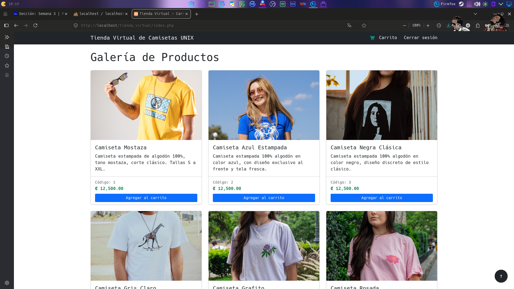

**Muestra la misma página principal, pero con el carrito de compras con 5 productos agregados.**

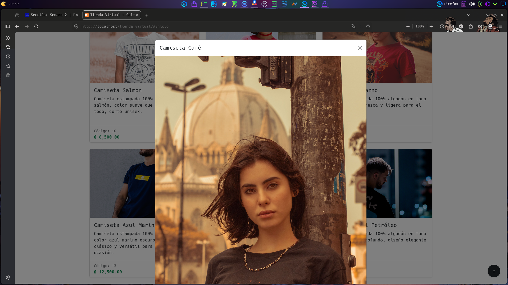

**Muestra el aviso que se presenta al usuario al cerrar la sesión, con un botón para iniciar sesión de nuevo.**

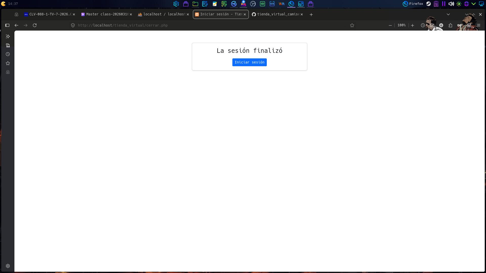

**Muestra el modal con la imagen ampliada de un producto.**

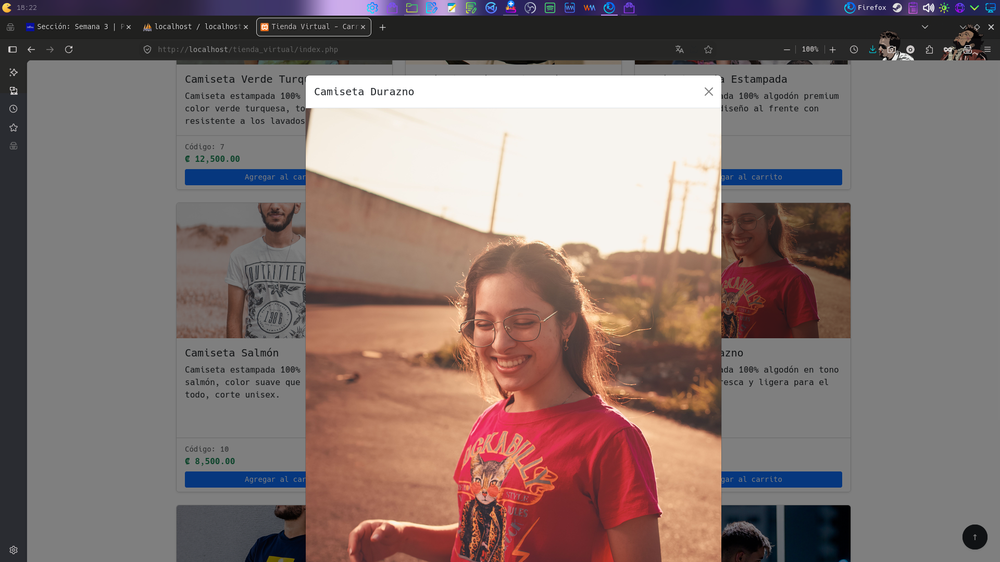

**Muestra en phpMyAdmin la consulta SELECT sobre la tabla Productos.**

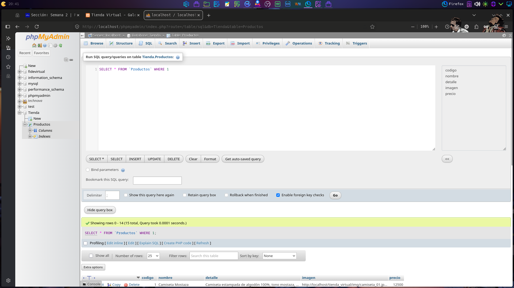

**Muestra en phpMyAdmin las filas (productos) de la tabla Productos.**

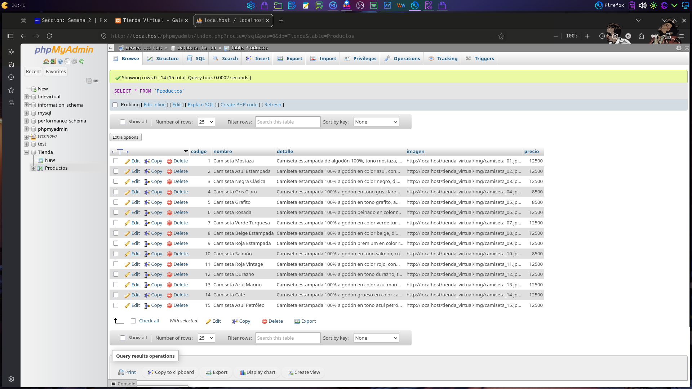

**Captura del formulario de consultas, que recoge el nombre, teléfono, correo y detalle de la consulta del cliente.**

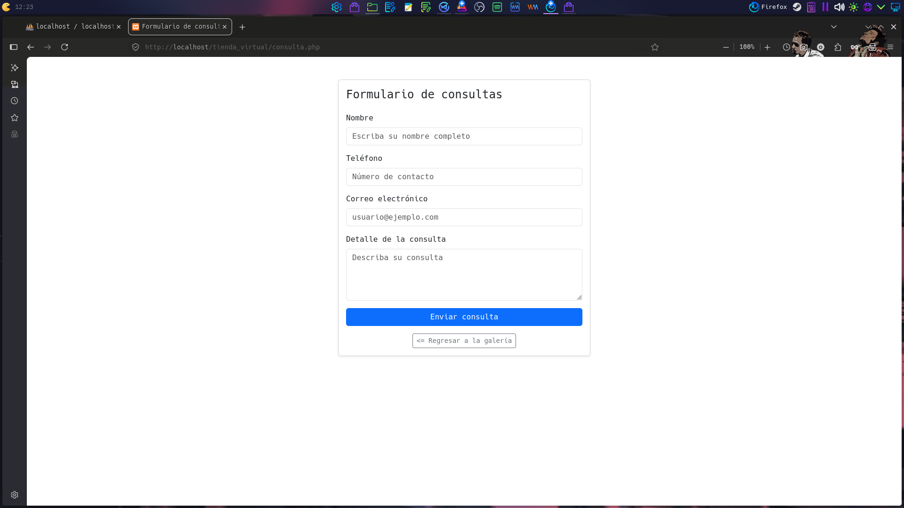

**Captura del resumen del contenido del carrito de compras, que detalla los artículos por pagar.**

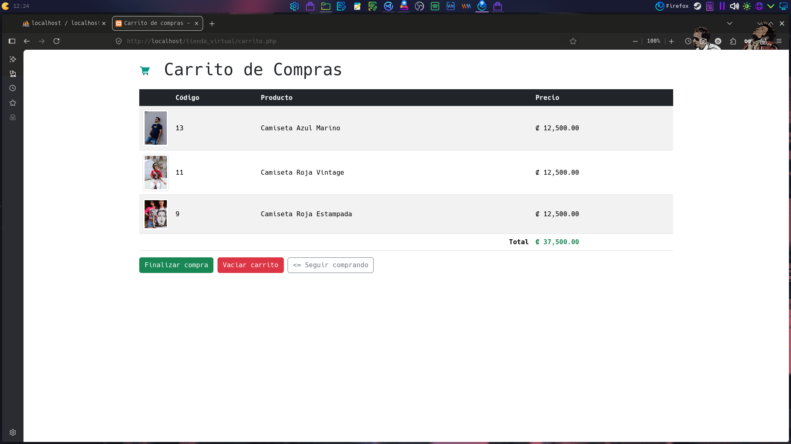

**Captura del proceso de finalizar compra, mostrando el monto total.**

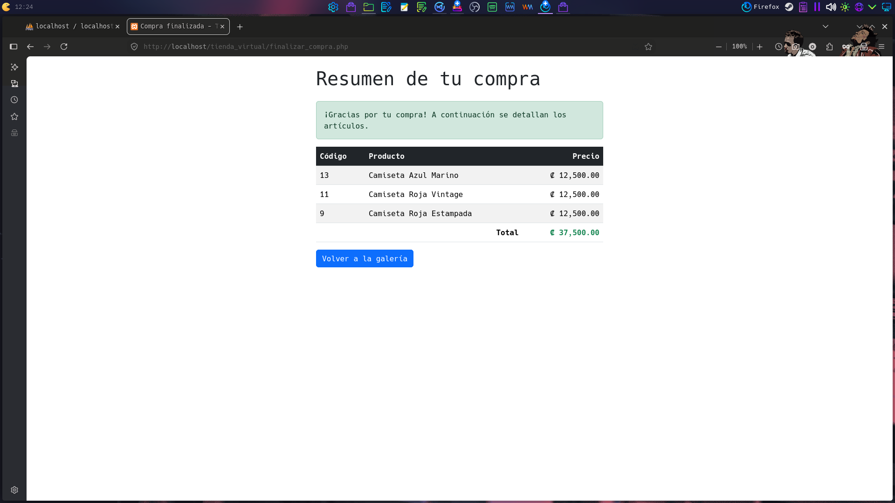

**Captura del ejemplo de manejo de errores, con el mensaje mostrado al usuario cuando falla la consulta de un inventario.**

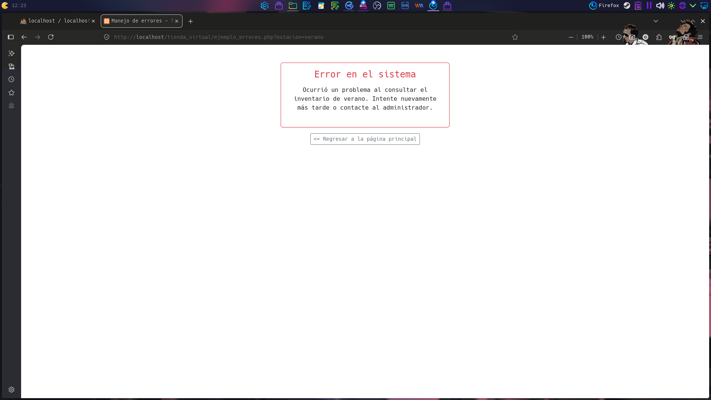

**Captura del log de errores de PHP, visto con el comando `tail -f` sobre el archivo del log.**

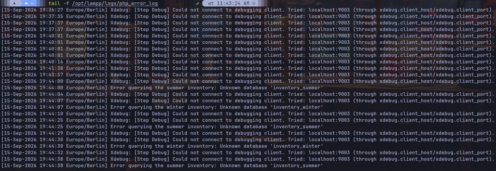
