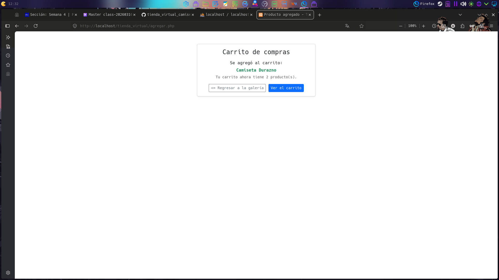
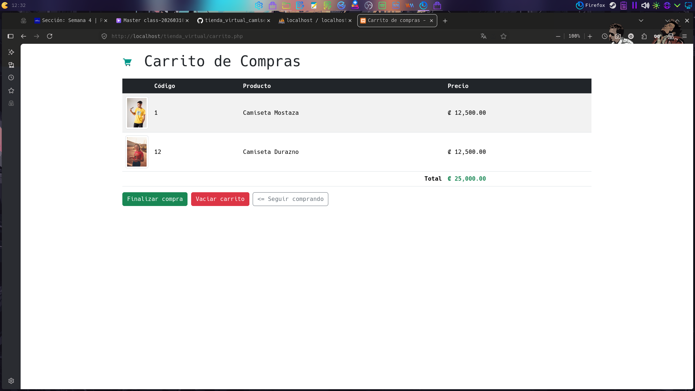
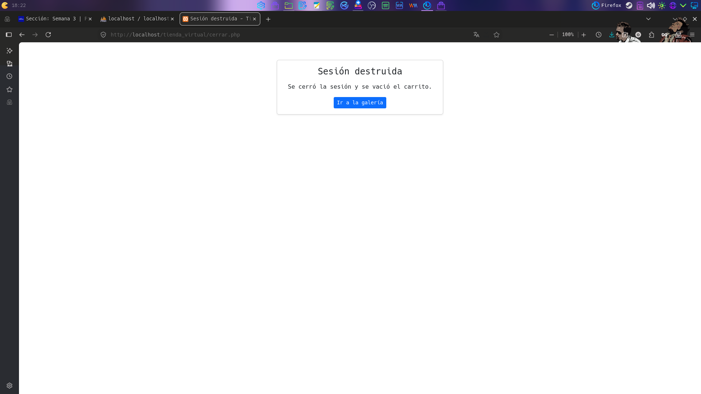

# Tienda Virtual de Camisetas UNIX

**Tienda Virtual de Camisetas UNIX** es un proyecto académico que implementa una tienda en línea sencilla de camisetas con temática UNIX. Está desarrollada en **PHP 8 (estilo procedural)** con **MySQL/MariaDB**, usando **Bootstrap 5.3.8** y **JavaScript** en el frontend.

Su funcionamiento se apoya en dos pilares:

- **Catálogo dinámico**: los productos (15 camisetas) se consultan desde la base de datos en MariaDB y se presentan en una galería de tarjetas.
- **Carrito de compras**: persistido mediante **sesiones de PHP** (`$_SESSION`), permitiendo agregar productos, ver el carrito, vaciarlo y cerrar sesión.

Aplica prácticas básicas de seguridad como **sanitización de salida** (escape de datos con `htmlspecialchars()` contra XSS) y **validación de entradas** (casts y comprobaciones antes de usar datos llegados del usuario).

## Funcionalidades

- Galería responsiva de 15 camisetas leídas desde MariaDB.
- Clic sobre cualquier imagen: modal de Bootstrap con la foto ampliada, nombre del producto como título y botón X de cerrado (también cierra con Esc o clic fuera).
- Botón flotante "volver arriba" con desplazamiento suave (esquina inferior derecha).
- Formato monetario del precio en colones.
- Botón "Agregar al carrito" por tarjeta: valida el producto en la base de datos y lo guarda como arreglo de códigos en `$_SESSION['carrito']`.
- Insignia "En tu carrito (xN)" en las tarjetas cuyos productos ya fueron agregados.
- Contador "Carrito (N)" en la barra superior que refleja los ítems acumulados.
- Página del carrito: consulta cada código en la base de datos, muestra miniaturas y total acumulado.
- Botón "Vaciar carrito": borra solo el carrito con `unset($_SESSION['carrito'])`.
- Enlace "Cerrar sesión": borra la cookie de sesión (con su path real) y ejecuta `session_destroy()`.

## Tecnologías

- PHP 8 (extensión mysqli y sesiones nativas)
- MySQL/MariaDB (servidor LAMPP)
- HTML5 + Bootstrap 5.3.8 (plantilla base skeletor.html)
- JavaScript (modal de imagen ampliada)

## Estructura del proyecto

```
tienda_virtual/
├── conexion.php        # Conexión a la base de datos MySQL/MariaDB
├── productos.php       # Lógica de consulta: obtiene los productos en el arreglo $productos
├── index.php           # Galería + formularios Agregar + insignias y contador de carrito
├── agregar.php         # Receptora POST: valida el código y lo guarda en la sesión
├── carrito.php         # Visualiza todos los ítems del carrito y el total
├── vaciar.php          # Borra solo el carrito (unset)
├── cerrar.php          # Cierra la sesión completa (cookie + session_destroy)
├── tienda.sql          # Script SQL: creación de tabla + 15 productos de prueba
├── README.md           # Este archivo
├── DOCUMENTACION.md    # Documentación técnica (arquitectura, flujo de datos, seguridad)
├── STEP-BY-STEP.md     # Guía paso a paso de instalación y entrega
├── css/
│   └── style.css       # Estilos propios complementarios a Bootstrap
├── js/
│   └── script.js       # JavaScript: apertura del modal al hacer clic en una imagen
├── img/                # Imágenes locales de los productos
│   ├── camiseta_01.jpg
│   ├── ...
│   ├── camiseta_15.jpg
│   └── icons8-shopping-cart-48.png  # Icono del carrito en la barra
└── screenshots/        # Capturas de pantalla del sitio y de phpMyAdmin
    ├── galeria_01.png  # Página principal de la tienda
    ├── galeria_02.png  # Galería con 3 productos en el carrito
    ├── galeria_03.png  # phpMyAdmin: lista de productos
    ├── galeria_04.png  # phpMyAdmin: resultado de un SELECT
    ├── galeria_05.png  # Modal con la imagen ampliada de un producto
    ├── carrito_01.png  # Confirmación al agregar un producto
    ├── carrito_02.png  # Contenido del carrito de compras
    └── sesion_destruida_01.png  # Aviso de sesión destruida
```

## Requisitos previos

- LAMPP/XAMPP instalado en `/opt/lampp`
- Apache y MariaDB funcionando

## Instalación y ejecución

```bash
# 1. Iniciar los servicios de LAMPP
sudo /opt/lampp/lampp start

# 2. Importar el script de base de datos (crea BD Tienda, tabla Productos y datos;
#    --default-character-set conserva las tildes del contenido)
/opt/lampp/bin/mysql -u root --default-character-set=utf8mb4 < tienda.sql

# 3. Publicar el proyecto en la raíz web de LAMPP (enlace simbólico)
sudo ln -s $PWD /opt/lampp/htdocs/tienda_virtual
```

Abrir en el navegador: <http://localhost/tienda_virtual/>

## Credenciales de base de datos (LAMPP por defecto)

| Parámetro  | Valor     |
| ---------- | --------- |
| Host       | localhost |
| Usuario    | root      |
| Contraseña | (vacía)   |
| Base       | Tienda    |

## Capturas de pantalla

**carrito_01:** interfaz que muestra los productos agregados al carrito de compras, así como la cantidad de productos y las opciones "regresar a la galería" o "ver el carrito".



**carrito_02:** muestra el contenido del carrito de compra.



**galeria_01:** página principal de la tienda virtual de camisetas UNIX.


**galeria_02:** muestra la misma página principal, pero con el carrito de compras con 3 productos agregados.


**galeria_03:** muestra el dashboard de phpMyAdmin con la lista de productos.


**galeria_04:** muestra el resultado de `SELECT * FROM Productos WHERE 1`.


**galeria_05:** muestra el modal para agrandar la imagen seleccionada de un producto.


**sesion_destruida_01:** muestra el aviso de sesión destruida y un botón para regresar a la galería.



## Notas de seguridad aplicadas

- `htmlspecialchars()` al imprimir datos de la BD (prevención de XSS).
- Cast `(int)` del código recibido por POST antes de usarlo en una consulta.
- `isset()` defensivo antes de leer `$_SESSION['carrito']`.
- Verificación de errores de conexión (`connect_error`) y de consulta (`error`).
- Las acciones que modifican datos (agregar, vaciar) se envían por POST.
- La conexión se cierra con `$conexion->close()` al terminar su uso.
- Estilo orientado a objetos mysqli.
